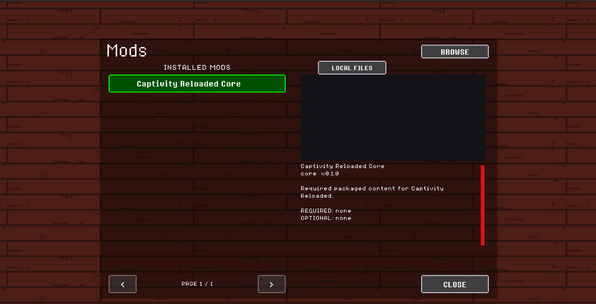
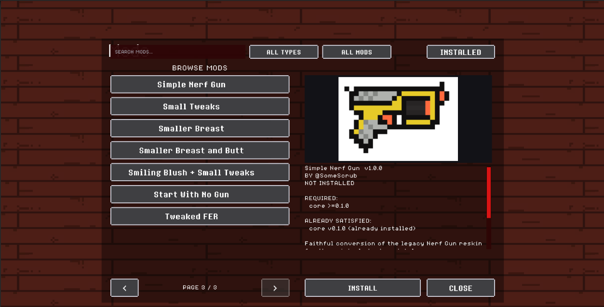
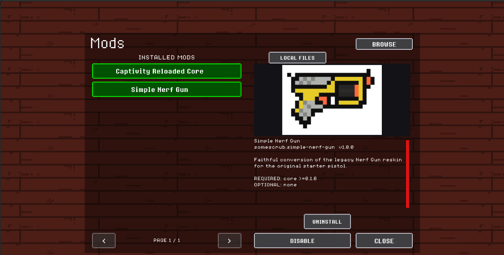
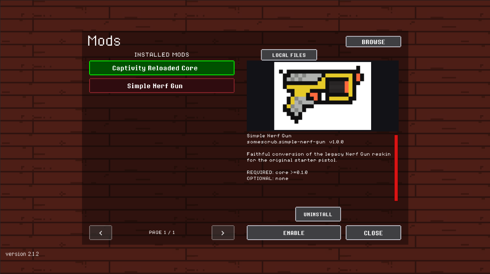

# Installing mods

Place each unpacked mod folder directly inside `Mods` beside the game executable:

```text
Captivity Reloaded.exe
Mods/
  example.my-mod/
    manifest.json
    content/
    assets/
```

You can also place a `.capmod` file directly in `Mods`. On the title screen, open **Mods > Local Files**, select the archive, and choose **Install**. The archive is validated and staged before the extracted mod is activated when you press **Apply Mods**. If that mod ID already has an installed folder, **Confirm Replace** keeps the old version for rollback; locally edited files are preserved separately. Successfully imported archives are moved to `.mod-imported` beside `Mods` so they are not offered again. A `.capmod` left loose in `Mods` is not loaded until you explicitly install it.

Start the game and open **Mods** on the title screen. Green rows are loaded, red rows are disabled, and yellow rows are invalid or conflicting. Select a pack to see its description, preview images, dependencies, and any validation problem. If no preview images are supplied, the preview box remains blank. Closing the panel after a change reloads the title screen and activates the new mod set.



Select **Browse** to load the approved GitHub catalog. Search matches names, IDs, summaries, authors, and tags. The type filter groups stages, characters, items, gameplay mods, and other packs; the status filter can show updates, installed listings, or packs not yet installed. A white rotating-arrow icon marks an available update. Catalog preview images are downloaded only for the selected listing and cycle every three seconds.



Catalog installation resolves compatible required dependencies and displays the full download set before making changes. Every ZIP is downloaded and validated before the transaction is committed. New installs are enabled automatically and become active after **Apply Mods** reloads the title scene. Updates keep the previous version for rollback. Uninstall keeps a recoverable copy that can be restored from the Mods screen.

After restart, an enabled pack is green and exposes **Disable** and **Uninstall**. A disabled pack is red and exposes **Enable** while retaining its installed files and saved data.

| Enabled and loaded | Installed but disabled |
| --- | --- |
|  |  |

If an installed catalog pack has edited or untracked files, updating requires a second confirmation. The updater preserves a separate copy of those local files before replacing the active folder. Apply pending changes before trying to change the same pack again.

Do not nest the pack inside an extra folder. `Mods/example.my-mod/manifest.json` is valid; `Mods/example.my-mod/example.my-mod/manifest.json` is not.

## Packaging a mod

Distribute one folder or ZIP whose top level contains `manifest.json`. Include the referenced `content` and `assets` directories, preserve filename case, and keep paths written with `/` in JSON. Unity `.meta` files, source art projects, editor caches, logs, and the game's own executable are not required by a data-only pack.

For menu previews, optionally add `"previewImages": ["assets/previews/1.png", "assets/previews/2.png"]` to the manifest and include those PNG files in the pack. Up to eight images are accepted in list order; the menu cycles through multiple images every three seconds.

After extracting a ZIP, the expected desktop layout is:

```text
Mods/
  example.my-mod/
    manifest.json
    content/
    assets/
```

Mods are loaded when the title scene starts. Close the Mods panel after installing, removing, enabling, disabling, or updating a pack; the game reloads the title scene before the changed content becomes available.

On Windows, manually installed folders live beside the executable. Android and WebGL use the game's persistent storage, so the in-game catalog is the intended installation route there. WebGL keeps downloads in memory and therefore applies smaller per-pack and dependency-batch limits. Android and WebGL player behavior still requires release-build verification before the catalog is considered production-ready.

## Troubleshooting

If a pack does not appear, confirm that `manifest.json` is directly inside the pack folder and that the folder is inside the `Mods` directory beside the Windows game executable. If it appears as disabled or invalid, select it in the Mods screen to read its dependency, conflict, and validation details.

Common causes include an extra nested directory from ZIP extraction, a missing required dependency, duplicate pack IDs, Windows-style `\` paths in JSON, references outside the pack, or a content ID whose namespace does not match the manifest ID. The loader leaves unrelated valid packs enabled and preserves save data belonging to a temporarily missing or disabled pack.
