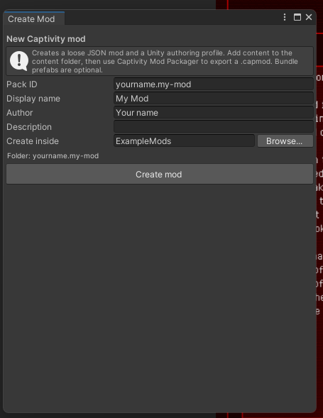
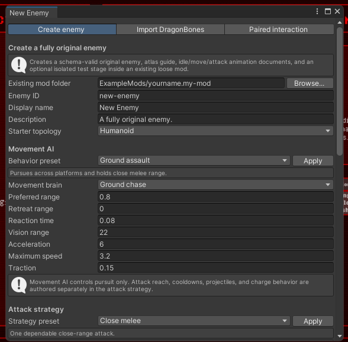
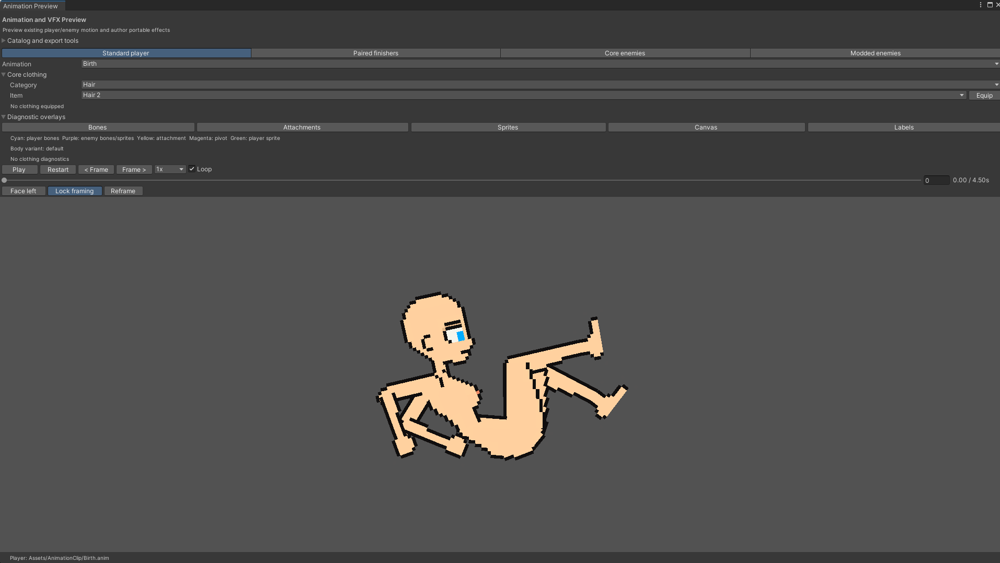
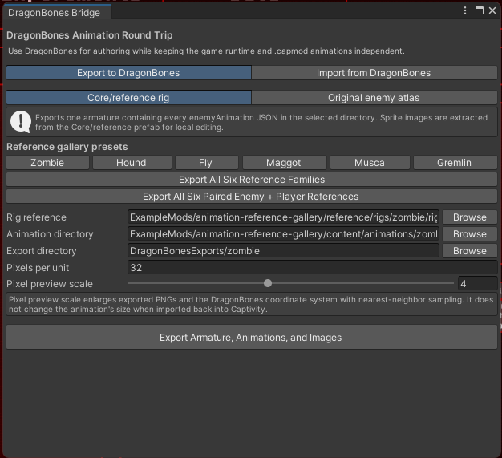
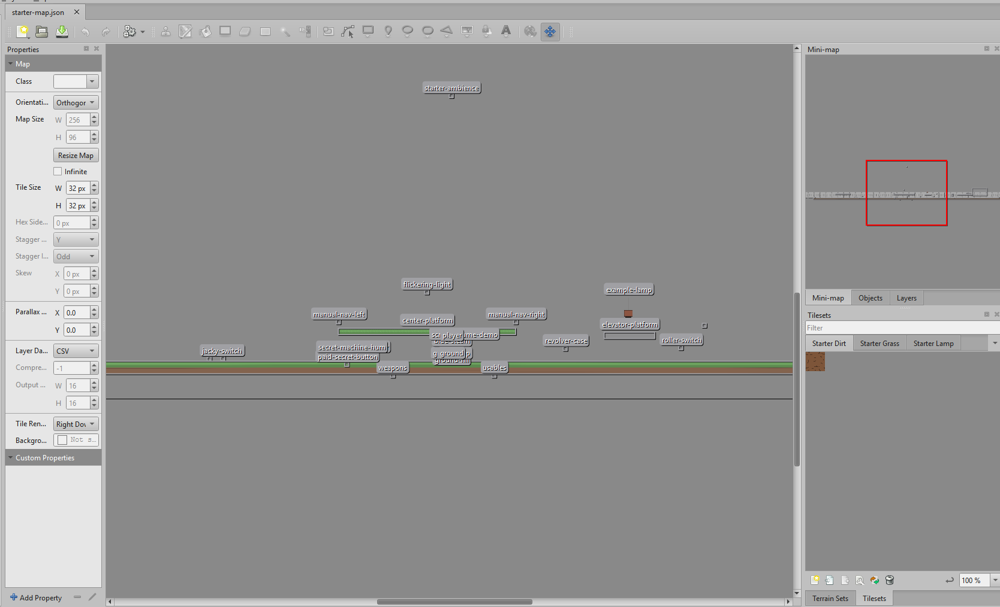
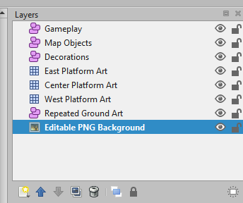
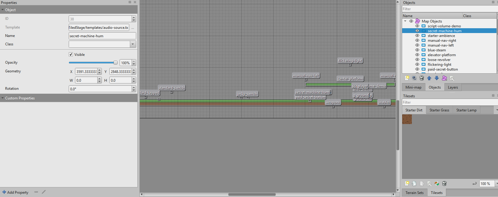
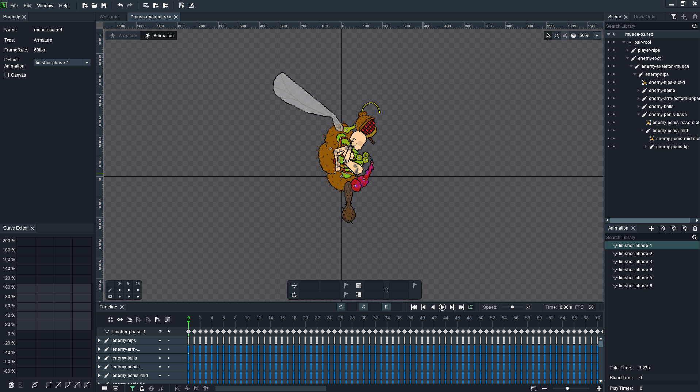

# Visual walkthroughs

This page collects screenshots from the current game, Unity project, and installed authoring applications. For installation and enable-state screenshots, see [Installing mods](../getting-started/installing-mods.md).

## Unity mod creation

Open **Captivity Reloaded > Modding > Create Mod...** to create the pack folder, starter manifest, content directory, and Unity authoring profile. The pack ID becomes the namespace for content owned by the mod.

Open **Captivity Reloaded > Modding > Create Original Enemy...** for a schema-valid original enemy scaffold. The first tab selects topology, movement behavior, attacks, and optional generated authoring files.

## Animation preview

Open **Captivity Reloaded > Modding > Player Animation Preview** to inspect player, paired-finisher, Core-enemy, or mod-enemy motion. The preview also exposes diagnostic overlays, facing, playback, framing, clothing, event, and portable-effect tools.

## DragonBones round trip in Unity

Open **Captivity Reloaded > Modding > DragonBones Round Trip**. Choose the reference family or original-enemy atlas workflow, verify the rig and animation directories, select an export directory, and export the armature, animations, and images.

## Tiled map authoring

Open `ModSDK/MapTemplates/TiledStage/levels/starter-map.json` or copy the complete `ExampleMods/tiled-training-yard` example. Keep the Layers panel visible while editing so object layers are not confused with decorative tile layers.

The example separates gameplay objects, map objects, decoration, platform art, repeated ground art, and the editable background into named layers. Preserve that separation when extending the map.

Select an object to inspect its template, name, position, and Custom Properties. Template-backed objects should keep the supplied template link; use Custom Properties only for supported per-instance overrides.

See [Tiled maps](tiled.md) for supported layers, properties, and export rules.

## DragonBones animation authoring

Import the JSON and texture files exported by **Captivity Reloaded > Modding > DragonBones Round Trip**. Do not rename bones or slots during the round trip; the importer maps them back to the frozen rig reference.

See [DragonBones round trip](dragonbones-round-trip.md) for the complete export/edit/import sequence.

## Useful follow-up captures

The core screenshot set is complete. Future releases can add these when their states are naturally available:

- an invalid pack with its exact validation code;
- a conflicting pack pair;
- a local `.capmod` selected under **Local Files**;
- the Unity **Captivity Mod Packager** after successful validation;
- an update or rollback confirmation containing more than one dependency.

Capture additions from the current release candidate at the default application theme, crop to the relevant application window, avoid personal paths or account names, and include enough surrounding UI for the reader to locate the control.
